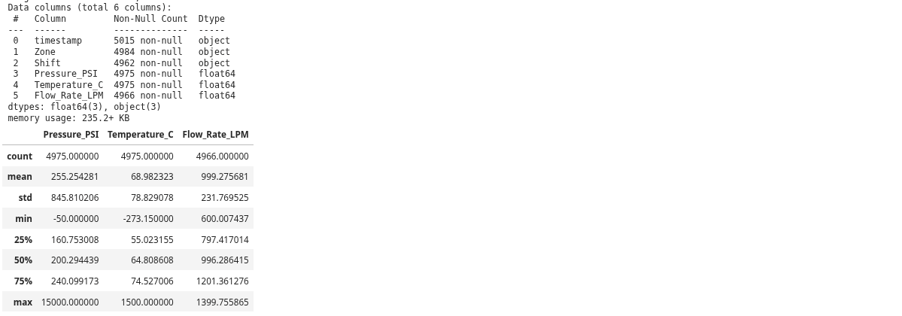
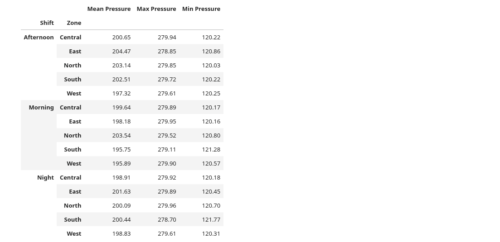
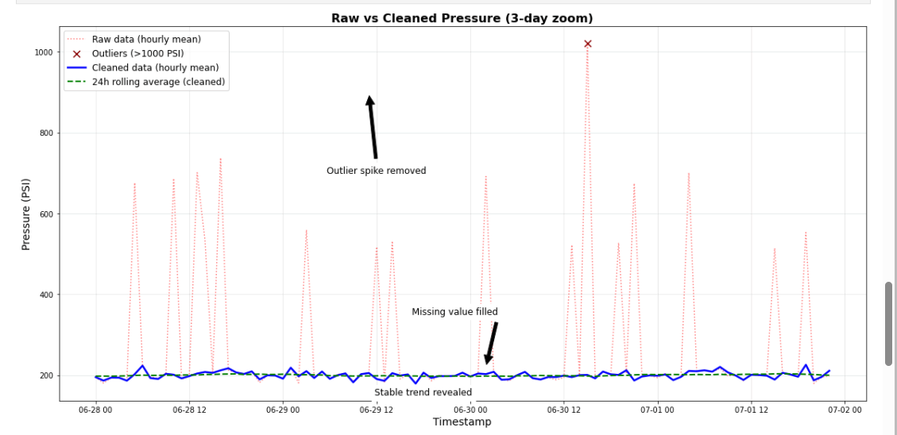

# Week 2 Data Wrangler – Ops Sensor Log Analysis

**Author:** EMMANUEL BRYAN AUKO
**Date:** 2 July 2026  

---

## Overview

This project processes a "dirty" operational sensor log (`ops_sensor_log_dirty.csv`) from a fictional processing plant. The pipeline loads, profiles, cleans, and analyses the data to uncover hidden operational patterns.

**Key objectives:**
- Identify data quality issues (missing values, outliers, inconsistent naming, duplicates).
- Clean the data using a reusable pipeline (timestamp conversion, interpolation, filtering).
- Resample to hourly frequency and compute a 24‑hour rolling average.
- Aggregate metrics by Shift and Zone.
- Visualise the impact of cleaning with annotations.
- Generate a 1‑page management report.

---

## Repository Contents

| File | Description |
|------|-------------|
| `week2_data_wrangler.ipynb` | Main Jupyter Notebook with all code and visualisations. |
| `ops_sensor_log_dirty.csv` | Raw input dataset. |
| `Week2_Insight_Report_Emmanuel_Auko.pdf` | Final 1‑page PDF report. |
| `README.md` | This file. |
| `shots/` | Folder containing screenshots of key notebook outputs. |

---

## How to Run

1. Ensure `ops_sensor_log_dirty.csv` is in the same directory as the notebook.
2. Open `week2_data_wrangler.ipynb` in Jupyter Notebook / JupyterLab / VS Code.
3. Run all cells sequentially.

### Dependencies

- `pandas`
- `numpy`
- `matplotlib`
- `seaborn`

Install with:

```bash
pip install pandas numpy matplotlib seaborn
```

---

## Results & Outputs

### 1. Data Profiling

The notebook loads the raw data and generates a "Data Health Report" using `.info()`, `.describe()`, and a missing‑values summary. The report identifies multiple quality issues that are later addressed in the cleaning pipeline.

> 📸 *Screenshot of the data loading and profiling output.*



---

### 2. Aggregation Summary

After cleaning, the data is grouped by **Shift** (Morning, Afternoon, Night) and **Zone** (South, North, East, West, Central). The table shows the Mean, Max, and Min Pressure (PSI) for each group.

> 📸 *Screenshot of the aggregation summary table.*



---

### 3. Annotated Visualisation

The key plot shows **Raw vs. Cleaned** pressure trends over a representative 3‑day window. Annotations clearly highlight where the cleaning process significantly changed interpretation – outlier spikes removed, missing data filled, and the daily cycle revealed.

> 📸 *Screenshot of the annotated plot from the notebook.*



---

## Key Insight

The raw data suggested a stable process with occasional spikes. After cleaning, a clear **daily pressure cycle** emerged:

- **Pressure drops during the Night shift.**
- **Pressure peaks during the Afternoon shift.**

This hidden trend enabled the operational recommendation to adjust compressor setpoints and implement automated alerting.

---

## Author

**EMMANUEL AUKO**  
Prepared for the Technical Coding Challenge – Week 2 Data Wrangler.

---

## License

This project is for educational and assessment purposes only.
```